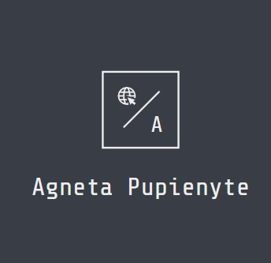

  
  
   

# 📗 Table of Contents

- [📖 About the Project](#about-project)
  - [🛠 Built With](#built-with)
    - [Tech Stack](#tech-stack)
    - [Key Features](#key-features)
    - [🚀 Live Demo](#live-demo)
- [💻 Getting Started](#getting-started)
- [👥 Authors](#authors)
- [🔭 Future Features](#future-features)
- [🤝 Contributing](#contributing)
- [⭐️ Show your support](#support)
- [🙏 Acknowledgements](#acknowledgements)
- [❓ FAQ (OPTIONAL)](#faq)
- [📝 License](#license)

# 📖 A to do list 
 

 
This To-Do-List project is a simple HTML list of To Do tasks. A simple web page built using webpack and served by a webpack dev server.

 
 

## 🛠 Built With 
 

  
Page was built using basic HTML, JavaScript & CSS, also webpack was used.

 

### Key Features 

 

- **Project is created dynamically**
- **Project is built using modules for feature adjustments**

(<a href="#readme-top">back to top</a>)

## 🚀 Live Demo & Video presentation  
 

- [Click me to view deployed project!](https://agneta1991.github.io/to-do-list/dist/)

(<a href="#readme-top">back to top</a>)

## 💻 Getting Started 
 

A great project whith a lot of modules, which can be used for other projects in the future.

To get a local copy up and running, follow these steps:
 
- Choose a directory
- Open a Terminal
- write git clone https://github.com/agneta1991/to-do-list
- get into to directory "to-do-list"
- write: npm install

(<a href="#readme-top">back to top</a>)

## 👥 Author 
 

👤 **Agneta Pupienyte**

- GitHub: [@githubhandle](https://github.com/agneta1991)
- Twitter: [@twitterhandle](https://twitter.com/pupienytea)
- LinkedIn: [LinkedIn](https://www.linkedin.com/in/agneta-pupienyte-124a27256/?originalSubdomain=lt)

(<a href="#readme-top">back to top</a>)

## 🔭 Future Features 
 

-**In the future CSS transitions & animation will be added to the page, to have more inviting / interactive vibe for the user**

(<a href="#readme-top">back to top</a>)

## 🤝 Contributing Contributions, issues, and feature requests are welcome!
 

Feel free to check the [issues page](https://github.com/agneta1991/to-do-list/issues).

(<a href="#readme-top">back to top</a>)

## ⭐️ Show your support 
 

If you like my page please show your support and give this page a star!
 
 

(<a href="#readme-top">back to top</a>)

## 🙏 Acknowledgments 
 

 
I would like to extend my heartfelt gratitude to Microverse for providing me with the opportunity to undertake this project. Additionally, I am immensely thankful to the code reviewers who takes the time to assess my work and provide valuable feedback, which greatly contributed to the refinement and success of the project. Your guidance and support have been invaluable throughout this endeavor, and I am truly grateful for your contributions.

(<a href="#readme-top">back to top</a>)

 

## 📝 License 

This project is [MIT](./LICENSE) licensed.
